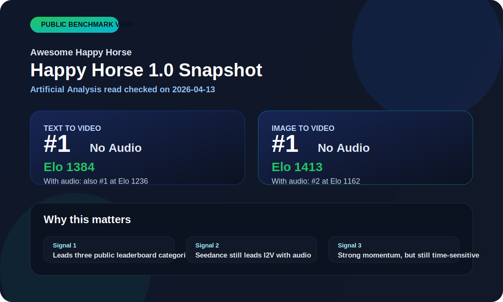

# Awesome Happy Horse

The most trustworthy Happy Horse resource hub: verified facts, benchmark snapshots, prompt cases, comparisons, timeline, and official-source tracking.

## What this repository is

This repository is a public intelligence and resource hub for [Happy Horse AI](https://tryhappyhorse.com/). It is designed for people who want one place to answer four practical questions:

- What is [Happy Horse](https://tryhappyhorse.com/) actually being presented as right now?
- Which public claims about [Happy Horse 1.0](https://tryhappyhorse.com/) are verified, likely, rumored, or already outdated?
- What do the current benchmark snapshots say, and what do they *not* say?
- Which prompt patterns and failure modes are worth paying attention to if you are evaluating the model seriously?

This repository is not affiliated with the Happy Horse team. It exists because the public information environment around [Happy Horse AI](https://tryhappyhorse.com/) is split across product pages, benchmark pages, GitHub SEO repos, and reposted social threads.

## Why this topic matters

[Happy Horse 1.0](https://tryhappyhorse.com/) is interesting for two reasons at the same time:

- On the product side, the current official public GitHub presence frames it as a cinematic video-generation product for creators and SaaS founders.
- On the benchmark side, public leaderboard snapshots currently place it at or near the top of several important AI video categories.

That combination creates a lot of noise fast. People start asking whether [Happy Horse](https://tryhappyhorse.com/) is already open source, whether it leads every category, which site is the right one, and whether community comparison clips are correctly labeled. This repository is built to reduce that confusion.

## The story so far

The current public timeline is short but important:

1. On `2026-04-08`, the public repository [`happyhorseai/happyhorse`](https://github.com/happyhorseai/happyhorse) appeared on GitHub.
2. Its public README launched as a marketing-oriented page, not as a code or model release.
3. Within the next 24 hours, community repos started expanding the topic into prompt hubs, rumor maps, benchmark summaries, and source trackers.
4. As checked on `2026-04-13`, Artificial Analysis public leaderboard pages show `HappyHorse-1.0` leading `Text to Video (No Audio)`, `Image to Video (No Audio)`, and `Text to Video (With Audio)`, while `Dreamina Seedance 2.0 720p` leads `Image to Video (With Audio)` with `HappyHorse-1.0` in second.
5. The official public GitHub repo still does not expose public weights or inference code.

The short version is: [Happy Horse AI](https://tryhappyhorse.com/) already has enough public benchmark gravity to matter, but the public release surface is still much thinner than the surrounding narrative.

## Current Snapshot

- **[Verified]** A public repository named [`happyhorseai/happyhorse`](https://github.com/happyhorseai/happyhorse) exists and was created on `2026-04-08`.
- **[Verified]** The current official public repo description frames [Happy Horse AI](https://tryhappyhorse.com/) as a product that turns text or images into `1080p cinematic video` with `advanced motion synthesis`, and says it is `free online` with `no sign up required`.
- **[Verified]** The current official public README is a marketing landing page, not a code release or model release page.
- **[Verified]** As checked on `2026-04-13`, Artificial Analysis lists `HappyHorse-1.0` at the top of both `Text to Video (No Audio)` and `Image to Video (No Audio)`.
- **[Verified]** As checked on `2026-04-13`, Artificial Analysis FAQ text lists `HappyHorse-1.0` as the current leader for `Text to Video (With Audio)`.
- **[Verified]** As checked on `2026-04-13`, `Dreamina Seedance 2.0 720p` leads `Image to Video (With Audio)` while `HappyHorse-1.0` is second.
- **[Rumor]** Claims that [Happy Horse 1.0](https://tryhappyhorse.com/) is already released as open weights are not supported by the current official public GitHub repo.

## Quick Navigation

Use the repository like a decision tool, not like a blog post.

| Section | Document | What it gives you | Best for |
| --- | --- | --- | --- |
| Fact Base | [Verified Facts](./docs/verified-facts.md) | Clean list of directly supported facts | Fast orientation |
| Claim Tracker | [Claims Ledger](./docs/claims-ledger.md) | Claim-by-claim status, confidence, and sources | Research and citation |
| Storyline | [Timeline](./docs/timeline.md) | The sequence of how [Happy Horse](https://tryhappyhorse.com/) became a public topic | Context and chronology |
| Benchmark Snapshot | [Benchmarks](./docs/benchmarks.md) | Dated leaderboard snapshots with Elo and sample counts | Performance tracking |
| Site Safety | [Official Links and Fakes](./docs/official-links-and-fakes.md) | Canonical surfaced link plus caution around noisy domain claims | Navigation and safety |
| Comparison Read | [Happy Horse vs Seedance](./docs/comparisons/happy-horse-vs-seedance.md) | Current public reading of the most important head-to-head comparison | Competitive context |
| Prompt Cases | [Prompt Library](./docs/prompts/prompt-library.md) | Reusable prompt cases with clear test goals | Hands-on evaluation |
| Risk Log | [Failure Cases](./docs/prompts/failure-cases.md) | Common ways readers and evaluators get misled | Risk reduction |
| Evidence Rules | [Methodology](./docs/methodology.md) | Status labels, evidence rules, and update logic | Trust and auditability |

## How to use this repository

### If you are trying to understand the model

Read [Verified Facts](./docs/verified-facts.md), then [Timeline](./docs/timeline.md), then [Claims Ledger](./docs/claims-ledger.md). That sequence gives you the cleanest progression from confirmed public facts to noisy public interpretation.

### If you care about benchmark performance

Start with [Benchmarks](./docs/benchmarks.md). It is the fastest path to the current `Elo / rank / sample count` snapshot for [Happy Horse 1.0](https://tryhappyhorse.com/). Then read [Happy Horse vs Seedance](./docs/comparisons/happy-horse-vs-seedance.md) for the narrative layer around the strongest public comparison.

### If you want to test the model yourself

Start with [Prompt Library](./docs/prompts/prompt-library.md). The prompt cases are written to expose useful dimensions like:

- multi-beat continuity
- direct-to-camera speech
- premium product framing
- identity retention in image-to-video
- material realism and controlled motion

Then read [Failure Cases](./docs/prompts/failure-cases.md) before drawing strong conclusions from any single output.

### If you are just looking for the right site

This repository standardizes all surfaced user-facing Happy Horse website links to [Happy Horse](https://tryhappyhorse.com/). If you need context on other publicly discussed domains, use [Official Links and Fakes](./docs/official-links-and-fakes.md).

## Why the README is structured this way

This README is organized so a reader can move from `what happened` to `what is true` to `what to test` without switching tabs or guessing which page to trust first.

The intended reading order is:

1. story and current state
2. document index
3. benchmark and claim context
4. prompt and failure-case utility

## Top Questions

### What is Happy Horse?

Based on the current official public repo description, [Happy Horse AI](https://tryhappyhorse.com/) is being presented as a text-to-image and image-to-video product with cinematic output claims. See [Verified Facts](./docs/verified-facts.md).

### Why is everyone suddenly talking about Happy Horse 1.0?

Because [Happy Horse 1.0](https://tryhappyhorse.com/) combines a polished public product narrative with unusually strong benchmark visibility. See [Timeline](./docs/timeline.md) and [Benchmarks](./docs/benchmarks.md).

### Is Happy Horse open source?

There is no evidence in the current official public GitHub repo that model weights or inference code have been published. See [Claims Ledger](./docs/claims-ledger.md#release-and-access-claims).

### Can I run Happy Horse locally?

Not based on the current official public GitHub repo. There is no publicly exposed weight package or inference package in the reviewed release surface. See [Claims Ledger](./docs/claims-ledger.md#release-and-access-claims).

### Is there an API for Happy Horse AI?

The strongest public benchmark pages currently show `Coming soon` style API language in the snapshot reviewed here, but that should be treated as a time-sensitive product status, not a guaranteed integration surface. See [Benchmarks](./docs/benchmarks.md).

### Does Happy Horse support audio generation?

The public leaderboard pages reviewed here include `with audio` categories where [Happy Horse 1.0](https://tryhappyhorse.com/) performs strongly, which is why audio comes up so often in current public discussion. See [Benchmarks](./docs/benchmarks.md).

### Does Happy Horse support both text-to-video and image-to-video?

At the public positioning and benchmark level, yes: [Happy Horse AI](https://tryhappyhorse.com/) is currently being discussed across both text-to-video and image-to-video contexts. See [Verified Facts](./docs/verified-facts.md) and [Benchmarks](./docs/benchmarks.md).

### Is there an official website for Happy Horse?

This repository standardizes all user-facing Happy Horse website links to [Happy Horse](https://tryhappyhorse.com/). If you need context on other publicly discussed domains, see [Official Links and Fakes](./docs/official-links-and-fakes.md).

### What is the current benchmark picture?

As checked on `2026-04-13`, [Happy Horse 1.0](https://tryhappyhorse.com/) leads `Text to Video (No Audio)`, `Image to Video (No Audio)`, and `Text to Video (With Audio)` in the Artificial Analysis public pages reviewed here, while `Dreamina Seedance 2.0 720p` leads `Image to Video (With Audio)` with HappyHorse-1.0 in second. See [Benchmarks](./docs/benchmarks.md).

### Why does Seedance come up so often?

Because `Happy Horse vs Seedance` is the dominant public comparison frame in the current GitHub and benchmark discussion. See [Happy Horse vs Seedance](./docs/comparisons/happy-horse-vs-seedance.md).

### Is Happy Horse better than Seedance?

The safest answer is more precise than a yes/no. As checked on `2026-04-13`, [Happy Horse 1.0](https://tryhappyhorse.com/) leads several public leaderboard categories, but Seedance still leads `Image to Video (With Audio)` in the reviewed snapshot. See [Benchmarks](./docs/benchmarks.md) and [Happy Horse vs Seedance](./docs/comparisons/happy-horse-vs-seedance.md).

### Who is Happy Horse being compared against besides Seedance?

The most important public comparison anchors right now are Seedance, Kling, and PixVerse. They matter because they are the clearest reference points in the current benchmark discussion. See [Benchmarks](./docs/benchmarks.md).

### Who is behind Happy Horse AI?

This repository tracks only what can be responsibly stated from reviewed public sources. If attribution is not supported clearly enough, it should not be repeated as fact. See [Claims Ledger](./docs/claims-ledger.md) and [Methodology](./docs/methodology.md).

### Where should I start if I want practical value?

Use [Prompt Library](./docs/prompts/prompt-library.md) for reusable test cases and [Failure Cases](./docs/prompts/failure-cases.md) for common traps.

### What are the best prompt angles to test first?

The current prompt set is designed around practical evaluation dimensions: cinematic environment control, multi-beat continuity, product visualization, direct-to-camera speech, and identity retention in image-to-video. Start with [Prompt Library](./docs/prompts/prompt-library.md).

### Should I trust random comparison clips on social media?

Not automatically. Public comparison clips can be mislabeled, decontextualized, or selectively chosen. Use [Failure Cases](./docs/prompts/failure-cases.md) before treating any single clip as proof.

### Why should I trust this repo?

Because the methodology is explicit, the claims are dated, the benchmark values are snapshot-scoped, and the repository keeps failure modes in scope instead of hiding them. See [Methodology](./docs/methodology.md).

## Notes for editors

- Use [Happy Horse](https://tryhappyhorse.com/), [Happy Horse 1.0](https://tryhappyhorse.com/), or [Happy Horse AI](https://tryhappyhorse.com/) as the user-facing website anchor text.
- Do not expose raw URLs for Happy Horse site links in reader-facing copy.
- Keep all major claims dated.
- Prefer restraint over certainty when the evidence is mixed.

## Contributing

Contributions are welcome if they improve evidence quality.

- Add a source for every new claim.
- Do not label anything `Verified` without a directly supportive public source.
- Prefer primary sources over reposts.
- Include `last checked` dates for updated benchmark or access claims.

## Suggested GitHub Metadata

- **Description:** `The most trustworthy Happy Horse resource hub: verified facts, benchmark snapshots, prompt cases, comparisons, timeline, and official-source tracking.`
- **Topics:** `happy-horse`, `happyhorse`, `happy-horse-ai`, `ai-video`, `text-to-video`, `image-to-video`, `prompt-engineering`, `benchmarks`, `awesome-list`, `video-generator`
