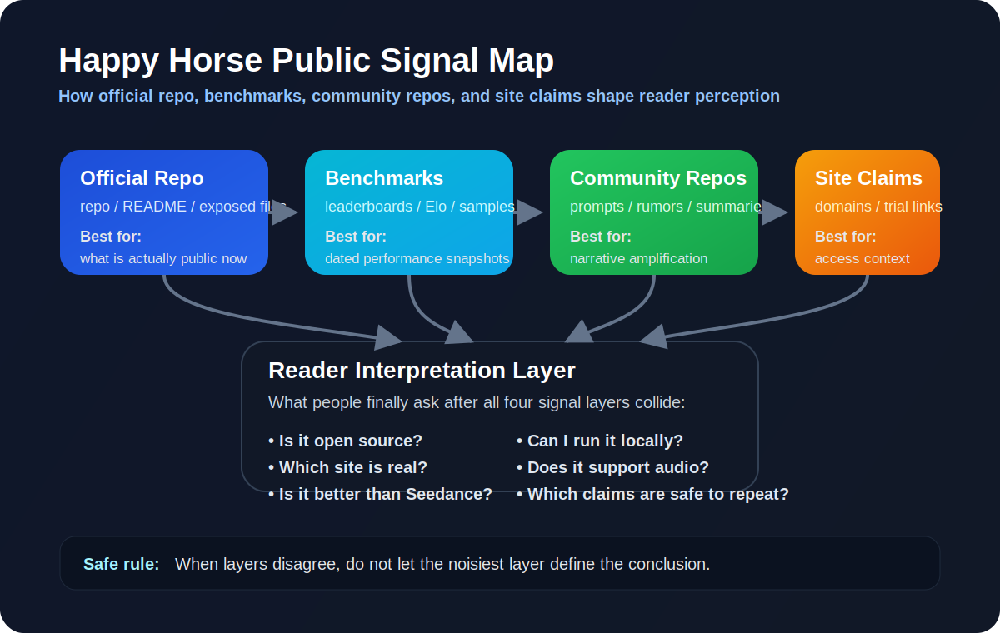
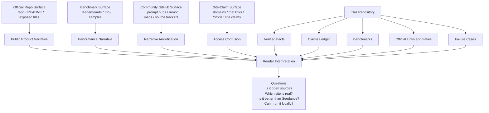

# Public Signal Surfaces

Last checked: `2026-04-13`

This page maps the main public signal layers around Happy Horse and explains how they relate to each other.

This visual is intentionally styled like a technical `framework + blueprint` infographic: clean zones, directional flow, explicit hierarchy, and restrained color coding. The goal is not decorative illustration, but high-compression structural understanding.

## Signal Diagram

## The Four Signal Layers

| Layer | What it contains | Strength | Main risk |
| --- | --- | --- | --- |
| Official repo surface | Public GitHub repo, repo description, README, current exposed files | Best source for what is directly public today | Can be very incomplete |
| Benchmark surface | Public leaderboard pages, Elo values, category positions, sample counts | Best source for current performance snapshots | Fast-moving and time-sensitive |
| Community GitHub surface | Prompt hubs, rumor maps, source trackers, comparison summaries | Good for seeing narrative spread and search demand | Can amplify unverified claims |
| Site-claim surface | Product domains, trial-link rumors, “official site” assertions | Useful for navigation context | High risk of mislabeling and fake authority |

## Relationship Map

### 1. Official Repo -> Product Narrative

The official public repo is currently the best direct source for:

- how Happy Horse is positioning itself in public
- which website it is explicitly linking to
- whether code or model release artifacts are actually exposed

It is the weakest surface for:

- deep technical disclosure
- historical narrative
- comparison context

Use:
- [Verified Facts](./verified-facts.md)
- [Claims Ledger](./claims-ledger.md)

### 2. Benchmark Pages -> Performance Narrative

The benchmark pages are the best direct source for:

- current rank
- current Elo
- current sample counts
- no-audio vs with-audio distinctions

They are weaker for:

- product access clarity
- technical release clarity
- attribution certainty

Use:
- [Benchmarks](./benchmarks.md)

### 3. Community Repos -> Narrative Expansion

Community GitHub repos matter because they are where the topic gets expanded into:

- prompt collections
- comparison frames
- rumor tracking
- source aggregation
- search-friendly thematic coverage

They are strongest for:

- seeing what people are asking
- seeing which comparison frames dominate
- discovering public examples and prompts

They are weakest for:

- confirming official status
- proving release availability

Use:
- [Claims Ledger](./claims-ledger.md)
- [Prompt Library](./prompts/prompt-library.md)
- [Failure Cases](./prompts/failure-cases.md)

### 4. Site Claims -> Access Confusion

Site claims are where readers get confused fastest. The main questions are:

- which domain is real?
- which page is just SEO?
- which site is safe to treat as a user-facing entry point?

This layer is the noisiest because fake authority is easy to manufacture with a polished landing page.

Use:
- [Official Links and Fakes](./official-links-and-fakes.md)

## How the layers interact

The common flow looks like this:

1. benchmark visibility rises
2. community repos amplify the narrative
3. site claims proliferate
4. readers assume more official clarity than actually exists

That is why this repository separates:

- `what is visible`
- `what is inferred`
- `what is still rumor`

## Monitoring Priority

If you only have time to check a few things, check them in this order:

1. **Official repo surface**
   - Did the repo structure change?
   - Were weights or inference files added?
   - Did the repo description or linked site change?

2. **Benchmark surface**
   - Did rank, Elo, or sample counts move?
   - Did category leadership change?
   - Did API status language change?

3. **Site-claim surface**
   - Is a new domain being promoted as official?
   - Is the currently visible site still aligned with the official repo surface?

4. **Community GitHub surface**
   - Which new claims are spreading?
   - Which comparison frame is becoming dominant?
   - Are there new prompt patterns worth preserving?

## What this page is for

Use this page when a reader asks:

- “why are the signals so contradictory?”
- “which layer should I trust for this question?”
- “why do benchmark wins not automatically prove release clarity?”
- “why do community repos feel more complete than the official repo?”

## Which layer to trust for which question

| Question | Best layer |
| --- | --- |
| Is there a public repo? | Official repo surface |
| Are weights exposed right now? | Official repo surface |
| What is the current Elo? | Benchmark surface |
| Is Happy Horse beating Seedance everywhere? | Benchmark surface + failure/caution layer |
| What prompts should I try first? | Community GitHub surface + prompt layer |
| Which site should I click? | Site-claim surface, filtered through this repo's editorial rules |

## Safe reading rule

If a claim depends on more than one layer, do not let the noisiest layer dominate the conclusion.

Examples:

- A leaderboard claim should be read from the benchmark layer, not from reposted commentary.
- A “site is official” claim should be read from the official repo layer first, not from community SEO pages.
- A strong-looking comparison clip should be checked against the failure layer before it is repeated as proof.
